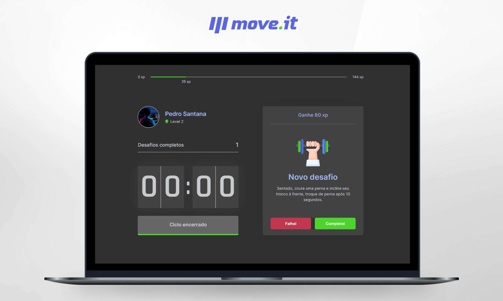

<h1 align="center">
  
</h1>

 

## 💻 Projeto

Essa aplicação foi desenvolvida durante a Next Level Week 4, promovida pela Rocketseat. O move.it é um app que une a técnica de Pomodoro com a realização de exercícios físicos para quem passa muito tempo na frente do computador.

  

## ✨ Tecnologias

Esse projeto foi desenvolvido com as seguintes tecnologias:

- [React](https://reactjs.org)
- [Next.js](https://nextjs.org/)
- [TypeScript](https://www.typescriptlang.org/)

## 🚀 Como executar

- Clone o repositório
- Instale as dependências com `yarn` ou `npm`
- Inicie o servidor com `yarn dev` ou `npm run dev`

Agora você pode acessar [`localhost:3000`](http://localhost:3000) do seu navegador.